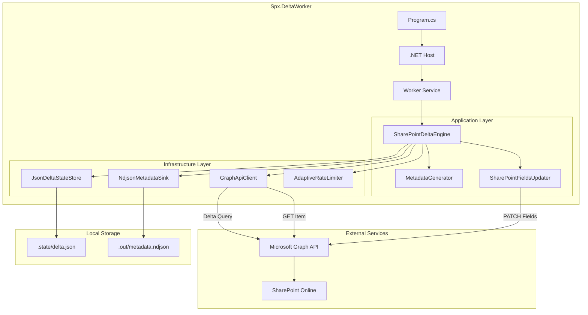
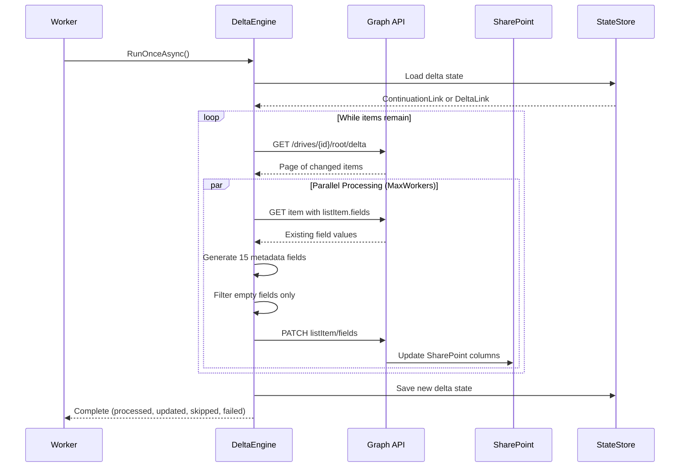
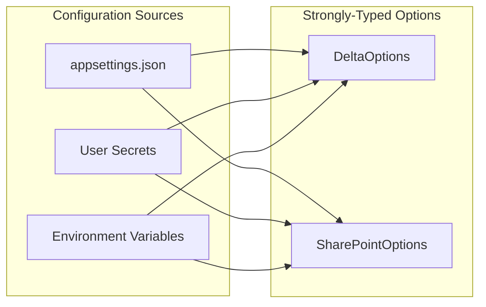

# Architecture

## Overview

`Spx.DeltaWorker` is a .NET 10 Worker Service that synchronizes SharePoint document metadata using Microsoft Graph Delta API. It automatically detects new/modified files and generates intelligent metadata for legal documents, then patches the SharePoint list item fields.

## System Diagram



## Processing Flow



## Component Details

### Program.cs
Bootstraps the .NET Generic Host with:
- Configuration binding (appsettings.json, user-secrets, environment variables)
- Dependency injection registration via `AddDeltaWorker()`
- Logging and tracing setup

### Worker (Background Service)
- Creates a `PeriodicTimer` from `Delta:PollIntervalSeconds`
- On each tick:
  - Creates a logging scope with `tickTime`
  - Starts an Activity (`delta.tick`) for distributed tracing
  - Calls `IDeltaEngine.RunOnceAsync()`
- On unhandled exceptions: logs and waits 5s backoff

### SharePointDeltaEngine
The core business logic implementing `IDeltaEngine`:

1. **Resolve IDs**: Gets SharePoint Site ID and Drive ID from URLs
2. **Delta Query**: Fetches only changed/new files since last run
3. **Parallel Processing**: Uses `Parallel.ForEachAsync` with `MaxWorkers`
4. **Metadata Generation**: Creates 15 intelligent fields per file
5. **Selective Update**: Only patches empty fields (respects `ForceUpdate`)
6. **State Persistence**: Saves delta link for incremental sync

### MetadataGenerator
Static class that generates 15 metadata fields:

| Field | Logic |
|-------|-------|
| TipoDocumento | Extension → Document type mapping |
| CategoriaInteligente | Extension → Category mapping |
| PalavrasChaveIA | Keywords extracted from filename |
| StatusProcessamento | "Processado" or "Importado EML" |
| SubpastaOrigem | Parent folder path |
| CaminhoCompleto | Full path including filename |
| NomeArquivoLimpo | Filename without extension |
| ExtensaoArquivo | Extension in uppercase |
| TamanhoBytes | File size from Graph API |
| DataCriacaoOriginal | Creation timestamp |
| DataModificacaoOriginal | Last modified timestamp |
| DataProcessamentoIA | Processing timestamp (now) |
| CriadoPor | Creator display name |
| IdadeArquivoDias | Age in days |
| IdadeArquivoDescricao | Human-readable age |

### AdaptiveRateLimiter
Automatically adjusts request rate to avoid Graph API throttling:

```mermaid
stateDiagram-v2
    [*] --> Normal: Start at RateLimitPerSecond
    Normal --> Throttled: HTTP 429
    Throttled --> Normal: After Retry-After
    Normal --> Increased: Sustained success
    Increased --> Normal: HTTP 429
    
    note right of Throttled: Rate reduced by 50%\n(min: 5/s)
    note right of Increased: Rate increased by +5\n(max: 2x initial)
```

### Infrastructure Components

| Component | Responsibility |
|-----------|---------------|
| `GraphApiClient` | HTTP client with auth token acquisition |
| `JsonDeltaStateStore` | Persists delta cursor to JSON file |
| `NdjsonMetadataSink` | Appends records to NDJSON for history |
| `SharePointFieldsUpdater` | PATCH requests to update list item fields |

## Configuration Binding



Options are validated with `DataAnnotations` at startup.

## Observability

| Type | Implementation |
|------|---------------|
| **Logging** | `ILogger` with structured logging, scoped per tick |
| **Tracing** | `System.Diagnostics.ActivitySource` ("Spx.DeltaWorker") |
| **Metrics** | Rate limiter stats logged per batch |

### Log Examples

```
info: Spx.DeltaWorker.Application.SharePointDeltaEngine[0]
      Starting delta processing with 20 parallel workers, rate limit 20/s

info: Spx.DeltaWorker.Application.SharePointDeltaEngine[0]
      ✅ Updated 12 fields: Contratos/2024/Contrato_Locacao.pdf

info: Spx.DeltaWorker.Application.SharePointDeltaEngine[0]
      Batch complete: 150 total (45 updated, 100 skipped, 5 failed) - Rate: 18/s
```

## Project Structure

```
SPX2/
├── worker/Spx.DeltaWorker/
│   ├── Program.cs                 # Entry point, host configuration
│   ├── Worker.cs                  # Background service with timer loop
│   ├── Application/
│   │   ├── IDeltaEngine.cs        # Interface for delta processing
│   │   ├── SharePointDeltaEngine.cs # Main business logic
│   │   ├── MetadataGenerator.cs   # Intelligent field generation
│   │   └── MetadataRecord.cs      # DTO for processed items
│   ├── Infrastructure/
│   │   ├── Graph/
│   │   │   ├── GraphApiClient.cs  # HTTP client with MSAL auth
│   │   │   └── GraphModels.cs     # Delta API response parsing
│   │   ├── State/
│   │   │   ├── IDeltaStateStore.cs
│   │   │   └── JsonDeltaStateStore.cs
│   │   ├── NdjsonMetadataSink.cs
│   │   ├── SharePointFieldsUpdater.cs
│   │   └── AdaptiveRateLimiter.cs
│   ├── Configuration/
│   │   ├── DeltaOptions.cs
│   │   └── SharePointOptions.cs
│   └── Hosting/
│       └── ServiceCollectionExtensions.cs # DI registration
├── tests/Spx.DeltaWorker.Tests/
├── docs/
└── SPX2.slnx
```

## Design Decisions

### Why Delta API?
- Efficient for large libraries (200k+ files)
- Only returns changes since last query
- Supports continuation for interrupted runs

### Why Parallel Processing?
- Ported from Python version (`MAX_WORKERS=20`)
- Significantly faster for large batches
- Rate limiter prevents API throttling

### Why Selective Field Updates?
- Default behavior preserves manual edits
- `ForceUpdate=true` available for full refresh
- Reduces unnecessary PATCH requests
